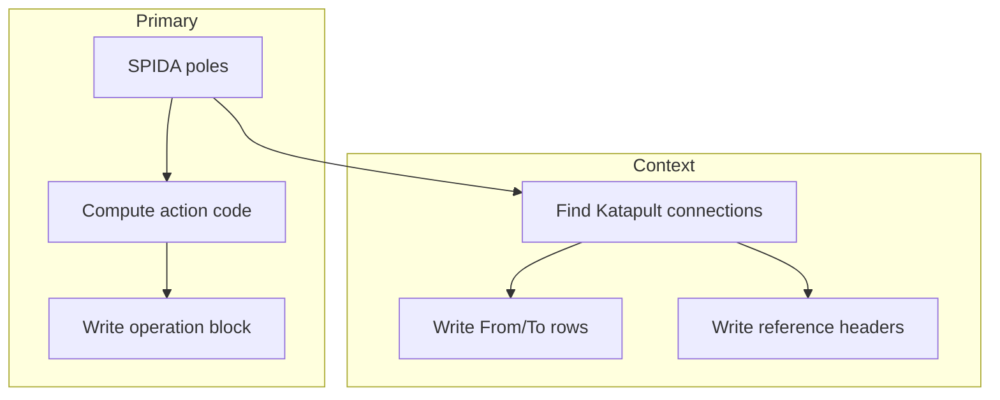

# Selecting Poles for the Make‑Ready Report

CPS has confirmed the following rules:

* **Primary operation blocks** (big blue header rows, merged A‑I) are created **only for poles that exist in the SPIDAcalc file**.  If a pole is not in SPIDAcalc it cannot receive direct make‑ready work in this project.
* Katapult may list *additional* poles (field extras, reference anchors, service poles).  These poles **still matter** for:

  * `From Pole` / `To Pole` cells that close each operation section
  * Orange / purple **reference blocks**
  * Bearing calculations (direction labels)

The generator therefore works in two passes:

| Pass            | Purpose                                                                                                                            | Output targets                                    |
| --------------- | ---------------------------------------------------------------------------------------------------------------------------------- | ------------------------------------------------- |
| **1 – Primary** | Iterate **every SPIDA pole** and decide if it needs an operation section (`(I)`, `(R)`, `(E)`).                                    | Columns A‑I header + attachment rows              |
| **2 – Context** | Scan Katapult connections that *touch* any primary pole.  Collect the **other endpoint pole tags** (even if they aren’t in SPIDA). | *From/To* light‑blue rows, reference‑span headers |

---

## 1 Primary‑pole inclusion signals

A SPIDA pole always makes the report because it’s in SPIDA, **but** we still classify its action code from Katapult activity:

| Code  | Trigger on that pole in Katapult                             | Example                            |
| ----- | ------------------------------------------------------------ | ---------------------------------- |
| `(I)` | Any attachment `proposed == true` (install)                  | Riser on **PL410620**              |
| `(R)` | An attachment exists in SPIDA but is **missing** in Katapult | AT\&T drop removed on **PL404474** |
| `(E)` | Only `mr_move` relocations                                   | Neutral resag on **PL370858**      |

*(If both installs and removals happen the pole is still `(I)` because installs dominate.)*

---

## 2 Finding *From* / *To* pole numbers

For each primary pole **P**:

1. Look at every Katapult `connection` whose `from == id(P)` **or** `to == id(P)`.
2. The *other* endpoint’s `pole_tag … tagtext` becomes either the *To* or *From* pole tag (ordered by route if needed).
3. If that endpoint tag is *not* in SPIDA → it appears **only** in the light‑blue row; no operation section is created for it.

> Example – operation at **PL398491**:
>
> * Connection C1: `from = PL398491`, `to = PL401451` → *To Pole* = **PL401451**
> * Connection C0: `from = PL410620`, `to = PL398491` → *From Pole* = **PL410620**

---

## 3 Reference span blocks

Katapult marks certain connections with `button_added == "reference"` & colour metadata.  For each of those:

1. Determine **direction** (bearing of the span) → label e.g. `Ref (North East) to service pole`.
2. Merge cells L‑O, shade orange (#FFCC99) or purple (#CCCCFF) per colour flag.
3. Under that header list attachments **on that span** (extract mid‑span heights from `sections`).
4. Both endpoint pole tags appear in that header but **only** the SPIDA endpoint gets an operation section elsewhere.

---

## 4 Algorithm summary

---

## 5 Unit‑test checklist

* [ ] Every `externalId` in SPIDA appears once in Column D.
* [ ] Columns J‑K show correct *From*/ *To* tags even when the To‑pole tag is not in SPIDA.
* [ ] No operation header is generated for a pure reference pole (e.g. service pole).

---

## 6 Revision history

| Date       | Version | Notes                                                                   |
| ---------- | ------- | ----------------------------------------------------------------------- |
| 2025‑05‑19 | v1.1    | Clarified two‑pass logic: primary (SPIDA) vs context (Katapult extras). |
